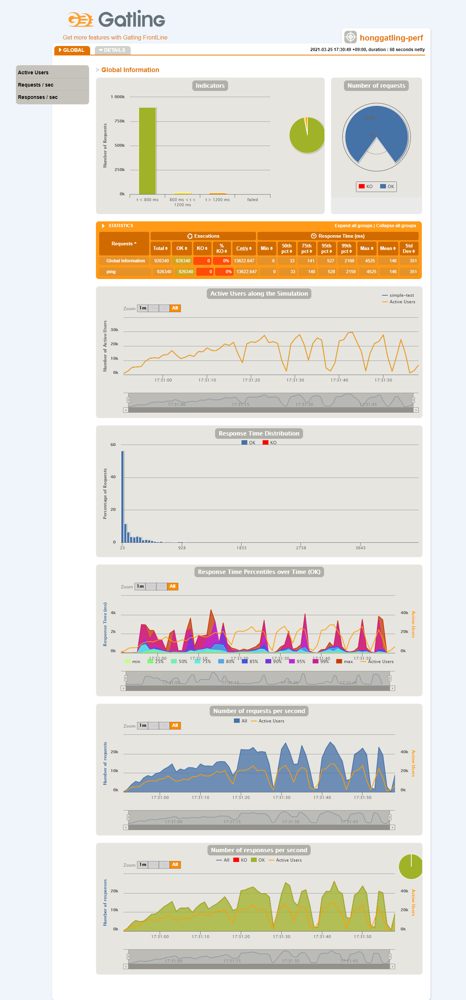
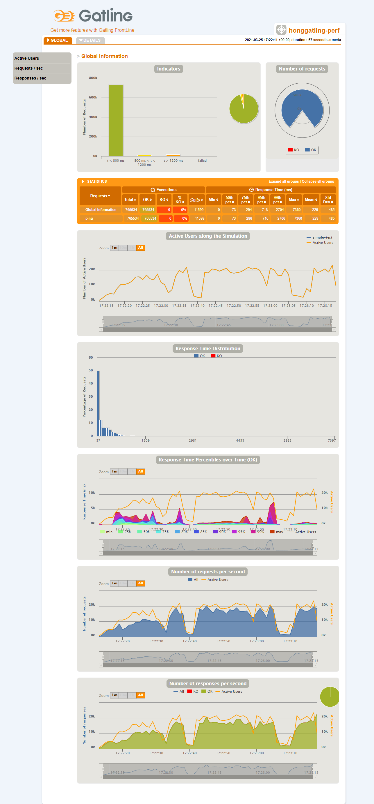
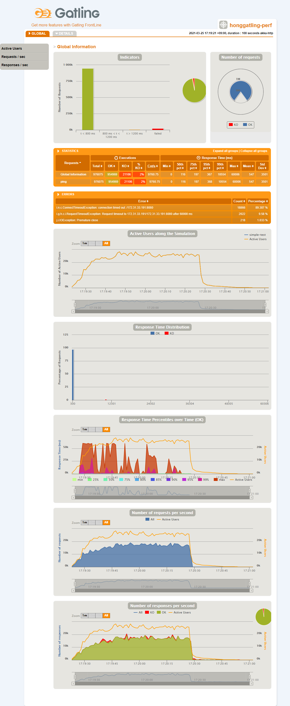
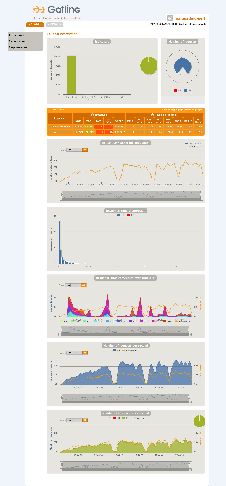
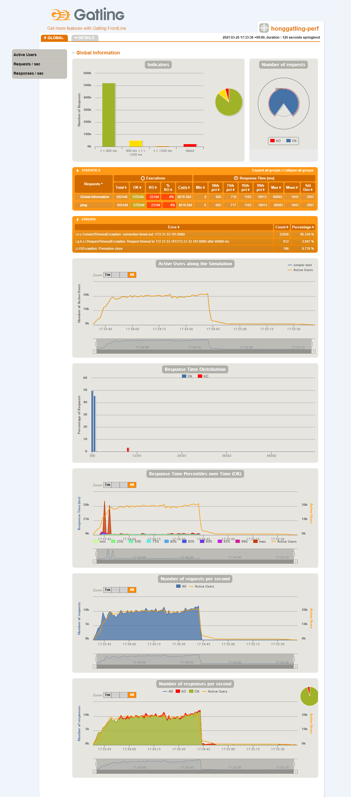
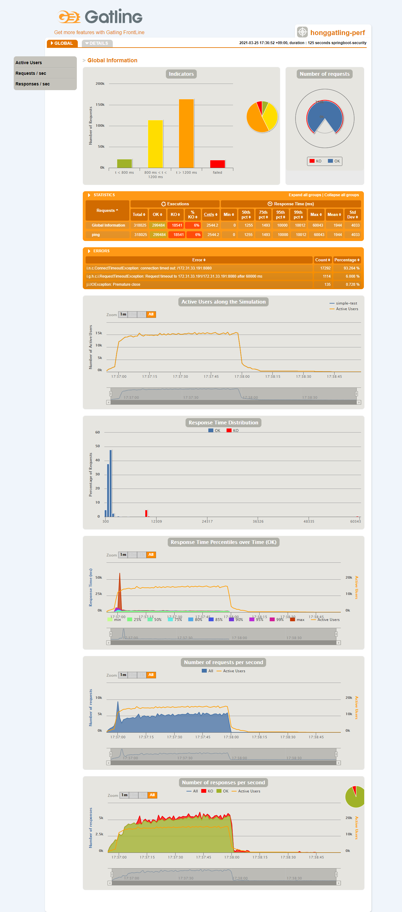
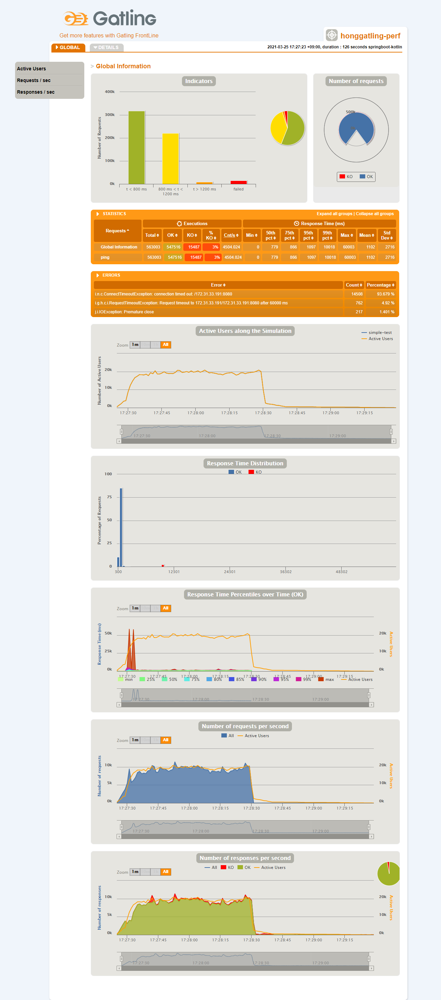
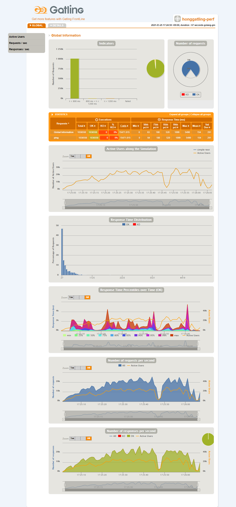

# Simple http performance test of various frameworks, and comparision
 I've tested simple http performance tests, and this is the comparison.

[https://soonpoong-hong.github.io/performance-test-of-various-frameworks/](https://soonpoong-hong.github.io/performance-test-of-various-frameworks/)

## Target frameworks
* netty 
* armeria
* akka-http
* vertx  
* spring webflux  
* springboot 2.3.9
* springboot 2.3.9 with spring security
* springboot 2.3.9 by kotlin
* graalvm with spring-native
* golang with gin

## Testing background
* Tested in AWS cloud ec2.
* server spec
  > * client(tool) : t3.medium (2 cpu, 4G memory)
  > * server : t3.medium (2 cpu, 4G memory)
* Performance testing tool : Gatling
* Testing load is 10,000 concurrent user.
* The testing tool request a URL of millisecond. (varying by millisecond)
  > (ex)  /1616726889044
* The target server extract the url and responds a text that is the three times to the url.
  > (ex)  161672688904416167268890441616726889044
* Test duration : 1 minute

## Limitation of this test
* It's just a very simple request. And doesn't match real situation.
  > (no database, no redis, no message queue, no http-client ...)
* System resource usage was not monitored.
* netty is a network library, so it is not suitable for this. But as I was curious to see how much performance would come out, so I added netty.

## Test Result

| framework | mean (msec) | counts/sec |
| ---- | ----: | ----: |
| netty | 146 | 13,622 |
| armeria | 229 | 11,599 |
| akka-http | 547 | 9,760 |
| vertx | 114 | 15,802 |
| springboot with webflux | 545 | 10,729 |
| springboot | 1043 | 4,819 |
| springboot with spring security | 1944 | 2,544 |
| springboot with kotlin | 1102 | 4,504 |
| graalvm with spring-native | 1099 | 4,398 |
| golang with gin | 154 | 15,471 |
  > * In mean time, the smaller is the better.
  > * In counts/sec, the higher is the better.

## Conculusion
First, keep in mind that this test is simply responding some text.

In other words, unless we make something like a gateway, this test may not make much sense.

Because, the eco system and ease of development and maintenance are much more important. 

OK, **My Conclusion** is,
> * `Golang` is the best in cost performance.
> * `Non-blocking` certainly has better performance than `blocking`. 
>   * But, what about the hassle and complexity of non-blocking? 
> * There is no performance degradation due to using `kotlin`.
> * There is about 50% performance degradation by using `spring security`.
> * `Graalvm` has a very good startup time, but the throughput is similar. 
 
## executable jar and runtime file
In the `executable-outputs` directory, There are executable jars and runtime files.

You can execute the jar with `java 11`.

[examples]
```sh
java -jar armeria-fat.jar
```
```sh
./gin-main
```
```sh
./rocklike.test.graalvmtest.graalvmserver
```

## Performance Testing Report
### netty

### armeria

### akka-http

### vertx

### springboot with webflux

### springboot

### springboot with spring security

### springboot with kotlin

### graalvm with spring-native

### golang with gin


